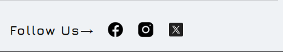

✔Below are the latest updates

🔅Update -06 Feb 2024 
💨01. Updated - Footer - for all Html files, All CSS files
        ✔ Todo  - replace all HTML Files with new ones.

  

💨03. Updated - Sub-category.html, product.html,account.html, order.html, cart.html & wishlist.html with "Bag" in place of cart .
        ✔ Todo  - replace all above mentioned HTML and CSS Files with new ones.
                 - Also replace icon folder with newone.          

💨04. Added - edit-profile.html, add-address.html and edit-address.html section.
        ✔ Todo  - replace all HTML and CSS Files with new ones. 

🔅Update -03 Feb 2024 -> Edit Profile and Add Address
💨01. Added - edit-profile.html and add-address.html
        ✔ Todo - Add HTML Files from "/main/user/foruser" .

💨02. Updated File - account.html-(line 195) and account.css.
        ✔ Todo - replace these HTML and CSS File with new ones.

🔅Update -03 Feb 2024
💨01. Updated File - account.html, cart.html, order.html and wishlist.html.
        ✔ Todo - replace all HTML Files  from  "/main/user/foruser" with new ones.

💨02. Updated File - Product.css, Mobile.css, cart.css, order.css, wishlist.css and Account.css.
        ✔ Todo - replace all css Files from "/assets/css"  with new ones.

🔅Update -30 Jan 2024
💨01. Updated File - wish.html (./user/foruser/wish.html) and wishlist.css (./assets/css/wishlist.html).
      * Updated Font - primary and secondary.
      ✔ Todo - replace all HTML Files and asset folder with new ones.

🔅Update - 28 Jan 2024
💨01. Updated File - All HTML Files & all css files.
      * Updated Font - primary and secondary.
      ✔ Todo - replace all HTML Files and css files with new ones.

💨02. Added File - cart.html(./user/foruser/cart.html) & cart.css(./assets/css/cart.css)
      * Added add-to-cart page.
      ✔ Todo - add files to your project workspace.

📢Note: The above changes will be reflected only after you replace the respective files

🔅Update - 25 Jan 2024
💨01. Updated file - nav.css (./assets/css/nav.css)
      * Updated logo as asked by Client.
      * Changed Colour and added slogan at the bottom.
      ✔ Todo : Replace nav.css file.
      

💨02. Updated file - All HTML files.
      * Added New List of Social media in Navigation section.
      * Updated all HTML files.
      ✔ Todo: i. Replace all html files with new ones(if required).
              ii. Replace nav.css and Mobile.css
              
              
📢Note: The above changes will be reflected only after you replace the respective files
    
